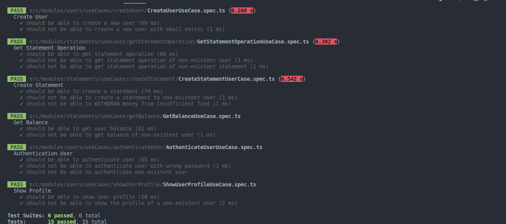

# 1º Desafio - Testes Unitários

## :computer: Sobre o desafio

Nesse desafio, você deverá criar testes unitários para uma aplicação já pronta usando tudo que aprendeu até agora sobre testes.

Para que você possa focar somente na parte de testes unitários sem precisar estudar muito a aplicação do zero, o template foi desenvolvido com base em uma aplicação já conhecida: **FinAPI**. A API construída no primeiro módulo da trilha.

**Users**:
  - **UseCases**: createUser, authenticateUser, showUserProfile;

**Statements**:
  - **UseCases**: createStatement, getBalance, getStatementOperation


## :camera: Screenshots

<div align="center">
  <h3 align="center">
    Testes unitários no UseCase de Users e Statements
  </h3>
  
</div>

# 2º Desafio - Transferências com a FinAPI

## :computer: Sobre o desafio

Neste desafio, você deverá implementar uma nova funcionalidade na FinAPI. A nova funcionalidade deverá permitir a transferência de valores entre contas. Para isso, você pode pensar na melhor forma de construir essa solução mas alguns requisitos deverão ser cumpridos:

  - Não deve ser possível transferir valores superiores ao disponível no saldo de uma conta;
  - O balance (obtido através da rota **/api/v1/statements/balance**) deverá considerar também todos os valores transferidos ou recebidos através de transferências ao exibir o saldo de um usuário;
  - As informações para realizar uma transferência serão:

  ``` json
  {
    "amount": 100,
    "description": "Descrição da transferência"
  }
  ```

  - O id do usuário destinatário será passado via parâmetro da rota (exemplo: **/api/v1/statements/transfers/:user_id**) e o id do usuário remetente poderá ser obtido através do token JWT enviado no header da requisição;

  - Ao mostrar o balance de um usuário, operações do tipo **transfer** deverão possuir os seguintes campos:

  ``` json
  {
    "id":,
    "sender_id":,
    "amount":,
    "description":,
    "type":,
    "created_at":,
    "updated_at"
  }
  ```

  - O campo **sender_id** deverá ser o **id** do usuário que enviou a transferência. O campo **type** também deverá exibir o tipo da operação, que nesse caso é **transfer**;

